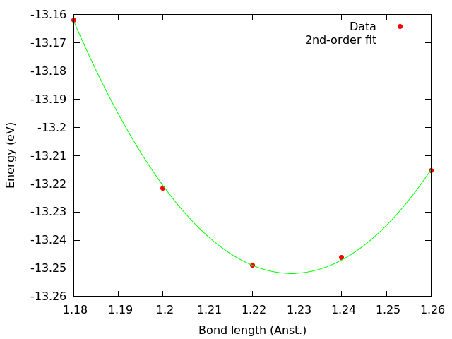

.. index:: OFDFT
.. _ofdft:

==============================================
Orbital-free Density Functional Theory (OFDFT)
==============================================
This page introduces the orbital-free DFT method in a comprehensive way. If you are already familiar with the theory and want to learn how to use the orbital-free GPAW module you can skip the introduction and go directly to the section running the code.

Theoretical introduction
========================

Orbital-based (Kohn-Sham) density functional theory
---------------------------------------------------
Density functional theory (DFT) has become possibly the most popular method for electronic structure calculations. This is due to its balance between accuracy and computational cost. However, the success of DFT mostly relies on the introduction of the Kohn-Sham single-particle ansatz. [#kohn-sham]_ DFT, as formulated by Hohenberg and Kohn in their seminal paper, [#hohenberg-kohn]_ is an exact theory. In principle all the properties of a system of interacting electrons in an external potential (for example that determined by the charged atomic nuclei) can be derived from the knowledge of the electronic density
`n`
and the universal energy functional
`E[n]`
, where the electronic density can be obtained variationally as the density that minimizes
`E[n]`
. The general form of this functional is

.. math:: E[n] = \langle \Psi | \hat{T} | \Psi \rangle + \langle \Psi | \hat{V} | \Psi \rangle,

where
`\hat{T}`
and
`\hat{V}`
, are the kinetic and potential energy operators, respectively, and
`|\Psi \rangle`
is the many-body wave function. The exact kinetic energy functional is then

.. math:: T[n] = \langle \Psi | \hat{T} | \Psi \rangle.

In practice, the form of the universal density functional is unknown and we must rely on
approximations. As we have already mentioned, introducing the Kohn-Sham single-particle ansatz is the most popular strategy to tackle this problem. Kohn and Sham proposed that the electronic density can be expressed as a sum of the density of a set of
`N`
non-interacting single-particle wave functions, also called orbitals:

.. math:: n(\textbf{r}) = \sum_{i=1}^N | \psi_i (\textbf{r})|^2.

The Kohn-Sham energy functional (in atomic units) now becomes

.. math:: E_\text{KS} [n] = -\frac{1}{2} \sum_{i=1}^{N} \langle \psi_i | \nabla_i^2 | \psi_i \rangle + \int \text{d}\textbf{r} \, V_\text{ext} (\textbf{r}) \, n(\textbf{r}) + \frac{1}{2} \int \int \text{d}\textbf{r} \, \text{d}\textbf{r}' \, \frac{n (\textbf{r}) \, n (\textbf{r}')}{|\textbf{r} - \textbf{r}'|} + E_\text{xc} [n(\textbf{r})].

The first term, denoted Kohn-Sham kinetic energy functional
`T_\text{s}[n]`
, now depends explicitly on the orbitals. All the other terms, including the exchange-correlation term
`E_\text{xc} [n]`
, depend only implicitly on the orbitals, because the density is calculated from them. Applying a variational principle to the expression for the total Kohn-Sham energy (e.g. that it is minimal with respect to changes in the wave functions), this formulation in turns leads to
`N`
Kohn-Sham Schrödinger-like equations (one per orbital):

.. math:: \hat{H}_\text{KS} \, \psi_i (\textbf{r}) = \epsilon_i \, \psi_i (\textbf{r}),

that need to be solved in order to obtain the orbitals. The aim of orbital-free DFT is to avoid the need to solve the
`N`
equations by removing the explicit dependence of the kinetic energy term on the orbitals, effectively obtaining a kinetic energy functional
`T[n]`
that depends explicitly only on the density. The motivation for this objective is straightforward: by reducing the complexity of the problem from
`N`
particles to one "particle" the computational cost is greatly reduced. In particular, the scaling law for the time cost versus system size is reduced from cubic (Kohn-Sham DFT) to linear (orbital-free DFT). The question that follows is a no-brainer: if orbital-free DFT is so wonderful why is it not the standard implementation of DFT?

Orbital-free density functional theory
--------------------------------------
An orbital-free formulation of DFT is more in line with the original spirit of the Hohenberg-Kohn theorems, [#hohenberg-kohn]  whereby the universal energy functional can be cast in terms of the electronic density alone. The success of the Kohn-Sham method relies on the fact that it provides an accurate description of the kinetic energy, which is the leading term in the total energy. All the many-body effects neglected by the Kohn-Sham independent-particle formulation are "pushed" into the exchange-correlation energy functional, which is then estimated by e.g. local-density, generalized-gradient or hybrid-functional (which typically include Hartree-Fock exchange) approximations. Therefore the accuracy that can be achieved within the realm of orbital-free DFT calculations heavily depends on the quality of approximated orbital-free kinetic energy functionals.
As a historically important development and to illustrate how critical the quality of the kinetic energy functional is, consider the kinetic energy functional of the non-interacting homogeneous electron gas, also known as the Thomas-Fermi kinetic functional:

.. math:: T_\text{TF} = \frac{3}{10} (3 \pi^2)^{2/3} \int \text{d}\textbf{r} \, [ n (\textbf{r})]^{5/3}.

When the Thomas-Fermi functional is used to represent the kinetic energy of electrons in matter, one obtains results that are quantitatively quite far from reality but, more importantly, are also qualitatively incorrect. For instance, DFT calculations based on the Thomas-Fermi functional fail to reproduce molecular bonding of simple diatomic molecules, such as H2, N2, O2, CO, etc. [#teller]_ On the other hand, calculations based on local-density approximations (LDAs) for the exchange-correlation functional (i.e. at the same level of approximation as the TF functional) used in combination with Kohn-Sham kinetic energies have been quite successful at describing qualitative and quantitative properties of matter, such as shell structure, molecular bonding, phase diagrams, elastic and structural properties, and so on.
It becomes clear at this point that the prospects of orbital-free DFT becoming a successful electronic structure method rely of refining the approximation of the kinetic energy functional as an explicit functional of the density alone. We shall come back to this issue later on.

Orbital-free implementation in GPAW: reusing a Kohn-Sham calculator
-------------------------------------------------------------------
Many years of development and popularization of DFT have left us with a variety of efficient codes to solve the Kohn-Sham equations and an active community hungry for new functionals. It would then be a great advantage if OFDFT calculations could be carried out reusing the computational tools already available. Levy et al. [#levy]_ showed that it is possible to reformulate the orbital-free problem in such a convenient way.
The total orbital-free (i.e. explicitly density-dependent) energy functional can be expressed as

.. math:: E_\text{OF} [n] = \underbrace{\int \text{d}\textbf{r} \, n^{1/2} (\textbf{r}) \left( - \frac{1}{2} \nabla^2 \right) \, n^{1/2} (\textbf{r})}_{T_\text{W} [n]} + J[n] + V[n] + E_\text{xc} [n] + T_\text{s} [n] - T_\text{W} [n],

where the first and last terms, known as the Weizsäcker functional, are just subtracting each other.
`J[n]`
and
`V[n]`
are the classical electrostatic energies due to electron-electron and electron-nuclei interactions, respectively, and
`E_\text{xc}[n]`
is the exchange-correlation energy functional, whose approximate form can correspond to any of the usual LDAs or GGAs developed for Kohn-Sham DFT available for GPAW.
The kinetic energy functional
`T_\text{s} [n]`
is the non-interacting Kohn-Sham kinetic energy, and the last two terms combined are known as the Pauli functional,

.. math:: T_\theta [n] = T_\text{s}[n] - T_\text{W} [n].

Levy et al. showed that a Kohn-Sham-like equation, derived variationally from the equation above, holds for the square root of the density:

.. math:: \left( - \frac{1}{2} \nabla^2 + V_\text{eff}(\textbf{r}) \right) \, n^{1/2} (\textbf{r}) = \mu \, n^{1/2} (\textbf{r}),

where
`\mu`
is the negative of the ionization energy. By making the equivalence between a single orbital and the square root of the density,

.. math:: \psi_0 (\textbf{r}) = n^{1/2} (\textbf{r})

, with the condition that
`\psi_0 (\textbf{r})`
renormalizes to the total number of electrons in the system, i.e.

.. math:: \int \text{d} \textbf{r} \, |\psi_0 (\textbf{r})|^2 = N

, we can rewrite Levy's expression in terms of this orbital,

.. math:: \left( - \frac{1}{2} \nabla^2 + V_\text{eff}(\textbf{r}) \right) \, \psi_0 (\textbf{r}) = \mu \, \psi_0 (\textbf{r}),

and use GPAW's Kohn-Sham solver truncated to a single orbital with its occupancy set to the total number of electrons. [#lehtomaki]_ This effectively orbital-free equation can be solved self-consistently using GPAW's iterative algorithms originally designed to solve the Kohn-Sham equations.
The development of accurate orbital-free kinetic functionals will focus on obtaining a close approximation to
`T_\text{s} [n].`
Historically, proposed orbital-free kinetic functionals incorporate only a fraction of the von Weizsäcker term, parametrized by
`\lambda`
and the full Thomas-Fermi contribution, or the other way around, where the Thomas-Fermi part is considered to be the correction to the Weizsäcker term. This dichotomy is known as the
`\text{"} \lambda
and
\gamma`
controversy". [#ludena]_
Both OF approximations to
`T_\text{s} [n]`
derive from the more general form

.. math:: T_\text{s} [n] \approx \gamma T_\text{TF} [n] + \lambda T_\text{W} [n]

, and the corresponding Pauli functional is

.. math:: T_\theta [n] \approx \gamma T_\text{TF} [n] + (\lambda - 1) T_\text{W} [n].

Since one could choose to construct a kinetic functional which does not explicitly include the Thomas-Fermi part, Thomas-Fermi is only one among possible OF kinetic functionals, we can express in a more general form
`T_\text{s} [n]`
as

.. math:: T_\text{s} [n] \approx T_\text{r} [n] + \lambda T_\text{W} [n],

where r stands for "rest", referring to the approximation to the total kinetic functional minus the included fraction of Weizsäcker. In practice, the "rest" term will be included in the code as part of the definition of the exchange-correlation functional, and the Weizsäcker contribution will be included via an additional parameter (see the next subsection on "λ scaling"). This more general form leads to the Pauli functional expressed as

.. math:: T_\theta [n] \approx T_\text{r} [n] + (\lambda - 1) T_\text{W} [n].

`\lambda` scaling

When using only a fraction of the Weizsäcker term the orbital-free equation needs to be rearranged in the following way due to convergence issues and practicalities of the implementation: [#lehtomaki]_

.. math:: \left( - \frac{1}{2} \nabla^2 + \frac{1}{\lambda} V_\text{eff}' (\textbf{r}) \right) \, \psi_0 (\textbf{r}) = \frac{\mu}{\lambda} \, \psi_0 (\textbf{r}).

The new modified effective potential has the form:

.. math::  V_\text{eff}' (\textbf{r}) = \frac{\delta}{\delta n} \left( T_\text{r} [n] + J[n] + V[n] + E_\text{xc} [n] \right).

Because of practical considerations, the term
`T_\text{r} [n]`
is included as part of a parametrized exchange-correlation energy functional when running GPAW's OFDFT module, as explained in detail in the section on running the code. Read through the next section to learn how the kinetic functional is defined in terms of how the present GPAW OFDFT implementation works.
Construction and suitability of orbital-free kinetic energy functionals
Although in principle any kinetic energy functional available from LibXC can be used to run OFDFT calculations in GPAW, we have only tested extensively a parametrized combination of Thomas-Fermi and von Weizsäcker, in combination with LDA exchange and correlation. On the list of ongoing research is the derivation of more accurate kinetic energy functionals. The recurrent (parametrized) form of the kinetic energy functional used in the examples below is

.. math:: E_\text{OF} [n; \lambda , \gamma] = \lambda T_\text{W}[n] + \gamma T_\text{TF}[n] + J[n] + V[n] + E_\text{xc}^\text{PW}[n],

where the fractions of Thomas-Fermi and von Weizsäcker are given by
`\gamma`
and
`\lambda`
, respectively, and the exchange-correlation energy functional is the Perdew-Wang LDA (although we could have chosen any other LDA of GGA functional). An extensive and detailed study on the performance of this parametrized functional for atoms has been presented in the paper by Espinosa Leal et al. [#espinosa]_
An important thing to note is that because of how the implementation is done in GPAW, your kinetic energy functional must always contain a fraction of Weizsäcker,
`\lambda T_\text{W} [n]`
, where
`\lambda`
is set by the use of the keyword tw_coeff. The definition of the remainder of the kinetic functional,
`T_\text{r} [n] = T[n] - \lambda T_\text{W} [n]`
, is done through the definition of the XC functional choosing a kinetic functional from those available in LibXC and prepending a number for the corresponding fraction to be incorporated into
`T[n]`
. For instance, in the example above,
`T[n] - \lambda T_\text{W} [n] = \gamma T_\text{TF} [n]`
. When defining this kinetic functional in GPAW, say for
`\lambda = 0.2 , \, \gamma = 0.8`
, we would do::

  lambda = 0.2
  gamma = '0.8'
 
  # Fraction of Weizsacker introduced through eigensolver definition
  eigensolver = CG(tw_coeff=lambda)
 
  # Fraction of Thomas-Fermi included in the definition of the XC functional
  xcname = gamma + '_LDA_K_TF+1.0_LDA_X+1.0_LDA_C_PW'

A note on convergence
---------------------
Convergence problems have been one of the historical obstacles to the development and spreading of OFDFT. Convergence instabilities of the self-consistency cycle have been attributed to the quality of the kinetic energy functional. [#karasiev]_ As a general rule, the more inaccurate the approximated orbital-free kinetic functional the more severe convergence problems will be. If you experience convergence problems, chances are that you are using an unreasonable approximation for the kinetic functional of your system.

Running the OFDFT GPAW module
=============================

Running GPAW's OFDFT module consists of two steps. The first thing to do is to generate the OFDFT PAW setups for each element and functional of interest. This needs to be done only once. The second step is to run the calculation itself. Both steps are described in detail below.

Setup generation
----------------
Before an orbital-free calculation can be carried out the PAW setups need to be generated. Currently, only a 1s projector can be used for setup generation, but the plan is to extend this capability in the future to be able to use a more flexible basis. Below we give a code example to generate the setup for a N atom with
`\lambda = 1, \, \gamma = 1`
and Perdew-Wang LDA exchange-correlation. The code includes the optimum cutoff distances for the augmentation spheres for all the atoms in the first three rows of the periodic table. N and the different functional options can be replaced by the desired values. Note that the definition of the functional is done separately for the Weizsäcker part (through the tw_coeff keyword) and the rest (Thomas-Fermi in the present case) which is done through the definition of the exchange-correlation functional. The orbital-free mode is enabled through the option orbital_free=True.
Also note that the parametrized exchange-correlation functionality allows to use a linear combination of the different exchange-correlation functionals available from LibXC by changing the number prepended. For instance, xcname='1.0_LDA_X+0.5_LDA_C_PW+0.5_LDA_C_PZ' would combine half Perdew-Wang with half Perdew-Zunger LDA exchange-correlation functionals.

.. literalinclude:: setup_generator.py

Running a simple OFDFT calculation
----------------------------------
Once the needed setups have been generated, an OFDFT calculation can be run similarly to any standard Kohn-Sham GPAW calculation. Remember to make the path where you saved your OFDFT setups available to GPAW via the setup_paths function, as in the example below, where we run a PAW calculation for a N atom. Also remember the name of your XC functional needs to match the name of the corresponding setup you generated. GPAW will recognize the setup as an OFDFT setup and the orbital-free mode will be automatically enabled.

.. literalinclude:: N_ofdft.py

Another example calculation
---------------------------

Here you will learn how to run a GPAW OFDFT calculation for the binding energy of an N2 molecule. Any other GPAW method, as explained in the different GPAW tutorials, can also be used with OFDFT by employing the definition of the GPAW calculator detailed here.
In the present example, our kinetic energy functional will be
`T [n] = T_\text{W} + T_\text{TF}`
, corresponding to
`\lambda = 1, \, \gamma = 1`
, and our XC functional will be Perdew-Wang LDA. Below you will find the steps you need to follow in this tutorial.

Generate the setups
Follow the instructions given in the section on running OFDFT for PAW setup generation for N. This should generate a file called "N.lambda_1.0.1.0_LDA_K_TF+1.0_LDA_X+1.0_LDA_C_PW" in your current directory, which contains the OFDFT PAW setup information for N generated with the desired energy functional.

Run the grid calculations
We will now run grid calculations for atomic N and molecular N2 using the setup generated in the preceding step. For the atomic calculation use the code given in the second part of the running OFDFT section. The energy calculated by GPAW on the grid is given with respect to the total energy of the atomic calculation done during setup generation, and should be close to zero. For the N2 molecule, we first need to optimize the bond length. In order to do so, plot the system's energy as a function of interatomic distance and look for the minimum, for instance by adding the following loop to your script (since the experimental bond length is about 1.098 Å we will start searching in that region)::
    
  for d in [0.9, 1.0, 1.1, 1.2, 1.3, 1.4]:
      molecule = Atoms('N2',
      positions=([c - d/2, c,c], [c+d/2,c,c]),
      cell=(a,a,a))

We plot the output, which looks like this:

.. image:: n2.png
    :align: center

Since errors with OFDFT can be quite large, the initial range was very wide (between 0.9 Å and 1.4 Å), and a 4th-order polynomial is required to fit the data. The analysis reveals that for this particular energy functional the equilibrium bond length of N2 is close to 1.2 Å, which allows us to refine the search by adding further data points around that value:

Refining the range allows us to establish the interatomic distance in :mol:`N_2` at approximately 1.229 Å for this functional, about +12% error compared to the experimental value. The energy calculation for :mol:`N_2 is thus performed for this value. The results are summarized in the table below:
System
Energy (eV)
Bond length (Å)
N
0.00723
n/a
N2
-13.25142
1.229
The binding energy,
` 2 E(\text{N}) - E(\text{N$_2$})`
is 13.266 eV. For reference, the experimental value is about 9.79 eV.

Accuracy
--------
For PAW calculations, as well as for pseudopotentials, the formalism itself will introduce (hopefully small) errors compared to full potential calculations, often referred to as "all-electron calculations" in the context of the frozen-core formalism. These errors also affect usual Kohn-Sham calculations, not only OFDFT. In the case of GPAW, the main sources of error will be the cutoff of the augmentation spheres and the grid spacing, both in the radial grid for atomic setup generation and the regular grid for PAW calculations. For N2 there is a full potential OFDFT calculation that we can use for reference, by Chan et al. [#chan]_ Since this reference calculation did not include correlation, in order to compare our result to Chan's we need to perform the same calculation as above removing the 1.0_LDA_C_PW from the definition of the XC functional, which yields 12.602 eV for our PAW calculation. The reference full-potential binding energy from Chan is 12.599 eV (0.463 Hartree) giving a deviation of only 0.004 eV.
As is the case for Kohn-Sham PAW calculations in GPAW, one would also need to check the effect of varying the cutoff radius of the setups and the grid spacing on the results. For the comparison with Chan's reference binding energy of N2, the table below summarizes the effect on the PAW calculation of changing the cutoff during setup generation while keeping the other parameters unchanged:
Rcut (Bohr)
N2 binding energy deviation (eV)
0.9
-0.091
1.0
-0.075
1.1
-0.031
1.2
-0.004
Note that as the cutoff is reduced the potential becomes harder (less smooth) and a finer grid would be required to keep the error small in the PAW calculation (this roughly corresponds to increasing the size of the basis in plane-waves calculations). The "default" values given in the scripts of the present tutorial correspond to our own optimization of these values, but depending on your own requirements for accuracy and your specific system under study you might have to consider optimizing these values yourself.
A much larger source of error than the technical parameters discussed above, and even more so for OFDFT calculations, is the choice of functional. For a test on the performance of different possible kinetic functionals, you can vary the values of
`\lambda`
and
`\gamma`
and repeat the calculation, in order to check how the choice of OF functional affects the values of bond length and binding energy.

Citation information
--------------------
If you use GPAW's OFDFT module for the compilation of published work, remember to add (in addition to the general GPAW and PAW references) a citation to the implementation paper [#lehtomaki]_ .

References
----------
.. [#kohn-sham] W. Kohn and L. J. Sham, Self-Consistent Equations Including Exchange and Correlation Effects, Phys. Rev. 140, A1133 (1965).
.. [#hohenberg-kohn] P. Hohenberg and W. Kohn, Inhomogeneous Electron Gas, Phys. Rev. 136, B864 (1964).
.. [#teller] E. Teller, On the Stability of Molecules in the Thomas-Fermi Theory, Rev. Mod. Phys. 34, 627 (1962).
.. [#levy]    M. Levy, J. P. Perdew, and V. Sahni, Exact differential equation for the density and ionization energy of a many-particle system, Phys. Rev. A 30, 2745 (1984).
.. [#lehtomaki]  J. Lehtomäki, I. Makkonen, M. A. Caro, A. Harju, and O. Lopez-Acevedo, Orbital-free density functional theory implementation with the projector augmented-wave method, J. Chem. Phys. 141, 234102 (2014).
.. [#espinosa]  L. A. Espinosa Leal, A. Karpenko, M. A. Caro, and O. Lopez-Acevedo, Optimizing a parametrized Thomas-Fermi-Dirac-Weizsäcker density functional for atoms, Phys. Chem. Chem. Phys. , (2015) DOI: 10.1039/C5CP01211B.
.. [#karasiev]    V. V. Karasiev, S. B. Trickey, Issues and challenges in orbital-free density functional calculations, Comp. Phys. Comm. 183, 2519 (2012).
.. [#chan]    G. K.-L. Chan, A. J. Cohen and N. C. Handy, Thomas-Fermi-Dirac-von Weizsäcker models in finite systems, J. Chem. Phys. 114, 631 (2001).
.. [#ludena]    E. V. Ludeña and V. V. Karasiev, Kinetic energy functionals: history, challenges and prospects, in Reviews of Modern Quantum Chemistry Vol. 1, pp612 (World Scientific, Singapore, 2002).

